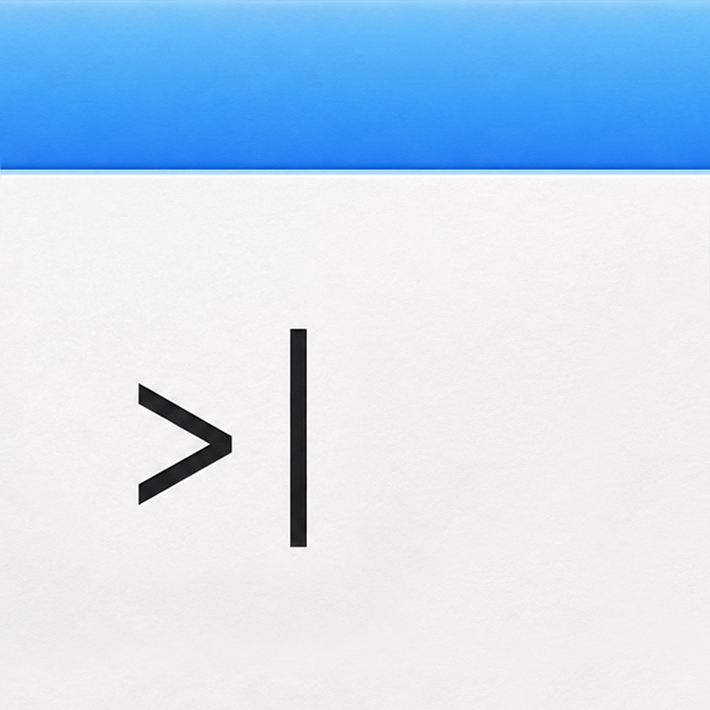

# Notepad++

A minimal native macOS text editor built with Swift and AppKit — no Xcode required.




## Features

- **Scratchpad mode** — opens instantly with your last text, no file required
- **File mode** — open, edit, and save `.txt` files
- **Save As** — always saves with `.txt` extension
- **Open from Finder** — double-click any `.txt` file to open it
- **Autocorrect toggle** — Edit → Autocorrect (persisted between launches)
- **Unsaved changes prompt** — never lose work by accident
- No Electron, no frameworks, no dependencies

## Requirements

- macOS 13 Ventura or later
- Xcode Command Line Tools

Install CLT if you don't have them:
```bash
xcode-select --install
```

## Build

```bash
git clone https://github.com/ahtlv/notepad-plus-plus.git
cd notepad-plus-plus
bash build.sh
```

The app is built to `build/Notepad.app`.

**Run directly:**
```bash
open build/Notepad.app
```

**Install to Applications:**
```bash
cp -r build/Notepad.app /Applications/
```

> **Note:** The app is unsigned. On first launch, right-click → Open to bypass Gatekeeper.

## Project Structure

```
notepad++/
├── Sources/
│   ├── main.swift                  # Entry point
│   ├── AppDelegate.swift           # App lifecycle, menus, file actions
│   ├── NotepadWindowController.swift  # Window, TextView, load/save logic
│   └── ScratchStore.swift          # Scratchpad persistence
├── Resources/
│   ├── Info.plist                  # Bundle metadata
│   └── AppIcon.icns                # App icon
├── icns/                           # Source icon assets
├── build.sh                        # Build script
└── Tests/
    └── test_scratch_store.swift    # ScratchStore unit tests
```

## Keyboard Shortcuts

| Action | Shortcut |
|--------|----------|
| New | ⌘N |
| Open | ⌘O |
| Save | ⌘S |
| Save As | ⌘⇧S |
| Quit | ⌘Q |
| Undo | ⌘Z |
| Redo | ⌘⇧Z |
| Cut / Copy / Paste | ⌘X / ⌘C / ⌘V |
| Select All | ⌘A |

## Changelog

See [CHANGELOG.md](CHANGELOG.md).

## License

MIT
